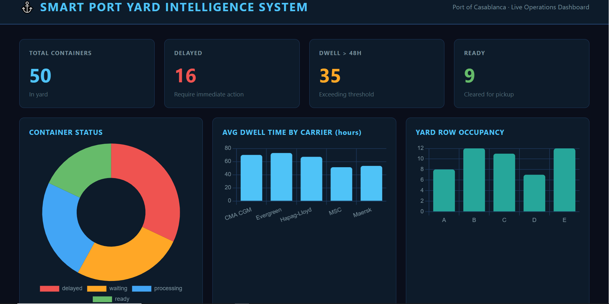

# ⚓ Smart Port Yard Intelligence System

> AI-powered operations dashboard for port container yard management — built with real-world insight from the Port of Casablanca.



## The Problem

Port yards run on human attention and paper. Containers are tracked manually, stacking decisions are made by intuition, and dwell time is rarely monitored in real time. The result is inefficiency, delays, and thousands of dollars lost every single day.

## The Solution

A fully functional AI-powered yard intelligence system that:
- Tracks containers across the yard in real time
- Flags dwell time violations automatically
- Analyzes carrier performance
- Generates professional operations reports using AI
- Visualizes everything in a live dashboard

## Modules

| Module | File | Description |
|--------|------|-------------|
| Data Engine | `data_generator.py` | Generates realistic container yard data |
| Analytics | `analytics.py` | KPI calculation, delay detection, carrier analysis |
| AI Reports | `ai_report.py` | LLM-generated operations reports via Groq API |
| Dashboard | `dashboard.py` | Produces a live HTML operations dashboard |

## Tech Stack

- Python, Pandas
- Groq API (LLaMA 3.3 70B)
- Chart.js
- HTML/CSS

## How to Run

```bash
# Install dependencies
pip install pandas faker groq python-dotenv

# Generate container data
python data_generator.py

# Run analytics
python analytics.py

# Generate AI report (requires GROQ_API_KEY in .env)
python ai_report.py

# Build dashboard
python dashboard.py
# Open dashboard.html in your browser
```

## Setup
Create a `.env` file in the root folder:
GROQ_API_KEY=your_key_here

## Built By
Anas Zraidi — AI & Business Analytics  
Inspired by a hands-on internship at the Port of Casablanca.  
[GitHub](https://github.com/AnasZraidi)